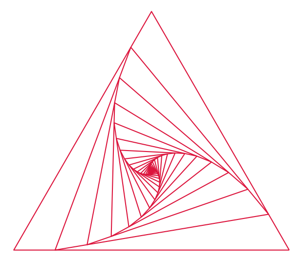
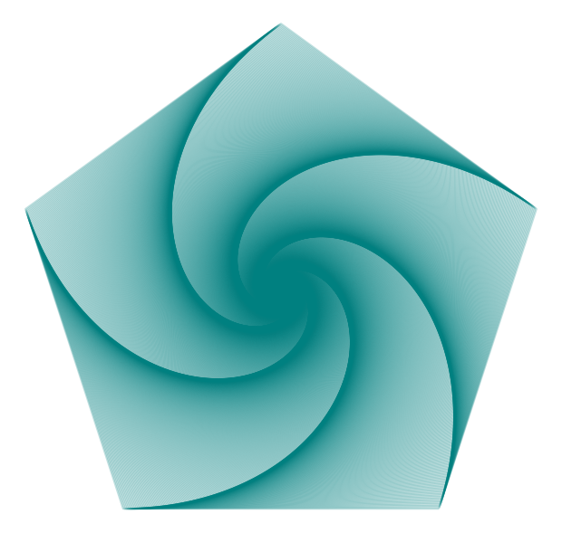
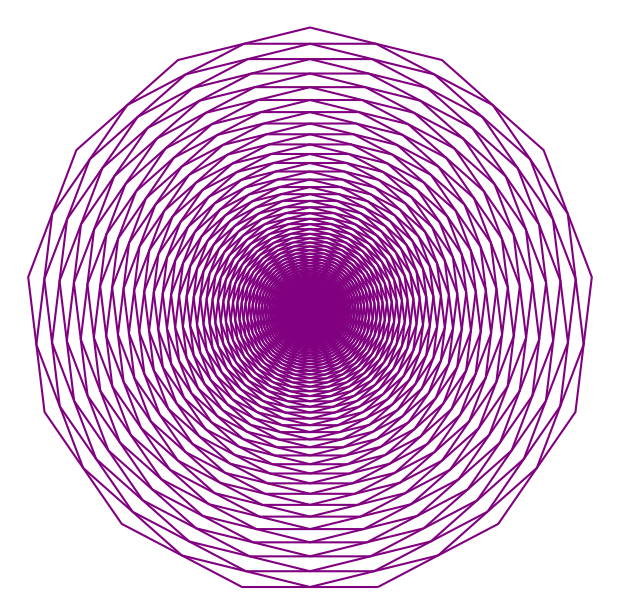

# itero

Visualization of iterative transformations.

`itero` is a lightweight Python package for visualising iterative linear interpolation on regular polygons. It builds a sequence of shrinking, rotating polygon shapes and renders the result as elegant line art.

---

## Sample outputs







---

## Features

- Generate regular polygons with configurable side counts
- Apply repeated vertex interpolation to create smooth evolving patterns
- Automatically compute a visually appropriate iteration count
- Render plots with Matplotlib and save to PNG, SVG, PDF, or other supported formats
- Command-line interface for quick experimentation and art generation

---

## Installation

Install the package into the active Python environment from the repository root:

```bash
python -m pip install -e .
```

If you want to use the repository virtual environment, activate it first and then install:

```powershell
\.venv\Scripts\Activate.ps1
python -m pip install -e .
```

If you only need to run the CLI without installing, use the virtual environment Python directly:

```powershell
\.venv\Scripts\python.exe -m itero --help
```

---

## Quick start

After installing with `pip install -e .`, run the CLI directly:

```bash
itero --num-sides 6 --ratio 0.2 --iterations 500 --color indigo --alpha 0.15 --save-path output.png
```

This generates a polished figure of the polygon iteration sequence and saves it to `output.png`.

Alternatively, run without installing by using the module directly:

```bash
python -m itero --num-sides 6 --ratio 0.2 --iterations 500 --color indigo --alpha 0.15 --save-path output.png
```

---

## Command-line options

```bash
python -m itero [options]
```

Options:

- `-n`, `--num-sides` — number of sides for the regular polygon (minimum 3)
- `-i`, `--iterations` — number of iterative transforms to apply
- `-r`, `--ratio` — interpolation ratio between vertices for each step
- `-c`, `--color` — plot colour, accepts Matplotlib colour names and hex strings
- `-a`, `--alpha` — opacity for each polygon line, between `0.0` and `1.0`
- `--figure-size` — figure width and height in inches
- `--save-path` — save the rendered figure to disk
- `--no-show` — suppress the interactive figure window when saving only

---

## Example commands

Create a sparse triangular pattern:

```bash
python -m itero --num-sides 3 --ratio 0.15 --iterations 400 --color crimson --save-path images/sparse_triangle.png
```

Generate a dense, soft pentagon pattern:

```bash
python -m itero --num-sides 5 --ratio 0.005 --iterations 2000 --color teal --alpha 0.25 --save-path images/dense_pentagon.png
```

Create a vibrant heptadecagon iteration:

```bash
python -m itero --num-sides 13 --ratio 0.5 --iterations 800 --color purple --save-path images/vibrant_heptadecagon.png
```


---

## Project structure

- `src/itero/` — package source code
- `tests/` — unit tests for geometry and transformation behaviour
- `docs/` — supporting documentation
- `images/` — generated example output images
